# Employee-Tracker

## Table of Contents
#### &nbsp;&nbsp;&nbsp;&nbsp;[1)&nbsp;Introduction](#introduction)
#### &nbsp;&nbsp;&nbsp;&nbsp;[2)&nbsp;Description](#description)
#### &nbsp;&nbsp;&nbsp;&nbsp;[3)&nbsp;Features](#features)
#### &nbsp;&nbsp;&nbsp;&nbsp;[4)&nbsp;Usage](#Usage-including-GitHub-Repository-URL-and-screenshots)
#### &nbsp;&nbsp;&nbsp;&nbsp;[5)&nbsp;Installation](#installation)
#### &nbsp;&nbsp;&nbsp;&nbsp;[6)&nbsp;Contributing](#contributing)
#### &nbsp;&nbsp;&nbsp;&nbsp;[7)&nbsp;License](#license)
#### &nbsp;&nbsp;&nbsp;&nbsp;[8)&nbsp;Questions](#questions)
    
## Introduction 

In business it is often the non-developers who need to view and interact with the important data upon which their organizations depend upon to function properly, so that they can plan accordingly.  Developers are therefore tasked with providing these users with custom CMS's, CMS standing for Content Management Systems.  In this project we were asked to design and build a system for managing a company's employees using Node, Inquirer, and mySQL, with a typical user story being business managers who want to view, and manage their employees, departments, roles/job positions, and budgets for organizational and planning purposes.

## Description

This application runs from the command line and starts by asking the user which of the following database tables they would like to view:  Employees, Departments, or Roles.  If a sudden phone call or other distraction comes in simultaneously they can simply exit and come back another time.

Within Employees a user can add, update, or delete an employee, or they can start again once one of those tasks is completed or if by chance they entered the wrong database table by mistake.  They can also exit the app.  If they are updating an employee, the user can choose between updating an employee's Role ID, or the employee's Manager ID.

Within Departments they can add or delete a department or they can view all of the salaries associated with a particular department.  Again they can also either start again or exit if they so choose.  Inside the Roles database they can similarly add a role, delete a role, start again, or exit.

## Features

A mySQL database was created to store the data and a series of inquirer.prompt questions were generated inside various functions to perform the different tasks asked of the application.  Validation was used throughout the inquirer.prompt questions to make sure that values were provided for each prompt without the application quitting.  Where validation was not utilized, specifically with regards to employee manager ID's, a user is allowed to just hit enter without providing a value because these are permitted to be 'null'.  Hitting return without entering information does not pass in a "null" value though, rather this just creates an empty string so code had to be written to accommodate this feature.

An 'inner join' was used via the mySQL database to provide a summary of all salaries within a given department so that a user can quickly and easily see how much of the budget is being used by each area of the company or organization.

## Usage including GitHub Repository URL and screenshots

To use this app, a user needs to go its GitHub repository and clone it into a folder on their own computer.  Once the folder is opened it is run from the command line beginning with "node app.js" as referenced.

<a href="https://github.com/7J647/Employee-Tracker">Click here to view this project's GitHub repository</a>

<a href="https://drive.google.com/file/d/1vp6uCC-voGH1UmS0-A8bt8cA9QQLFMOg/view">Click here to view a video demonstrating the app's functionality</a>

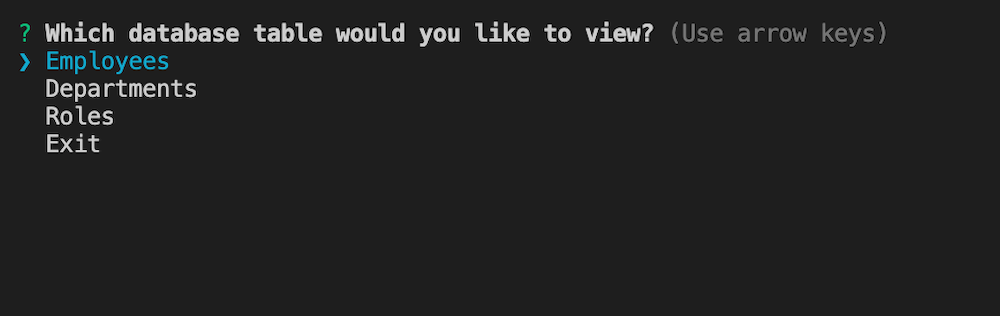
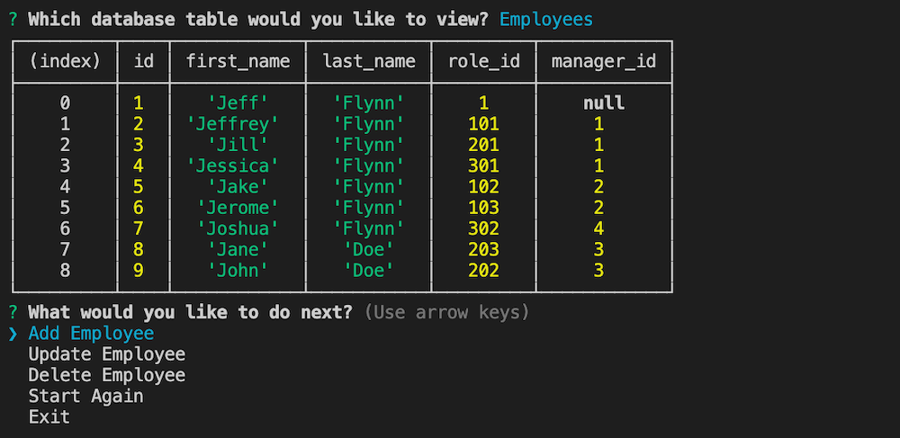
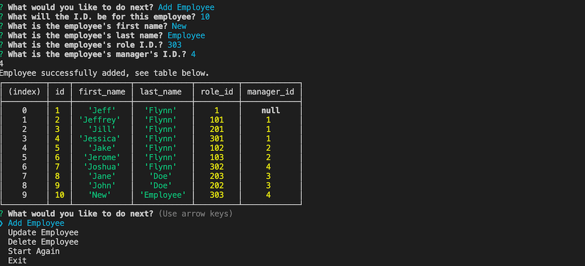
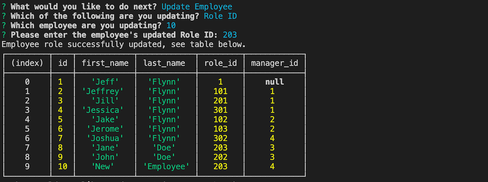
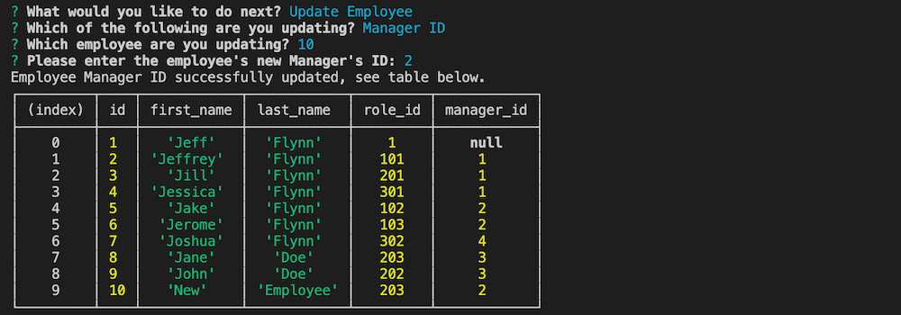

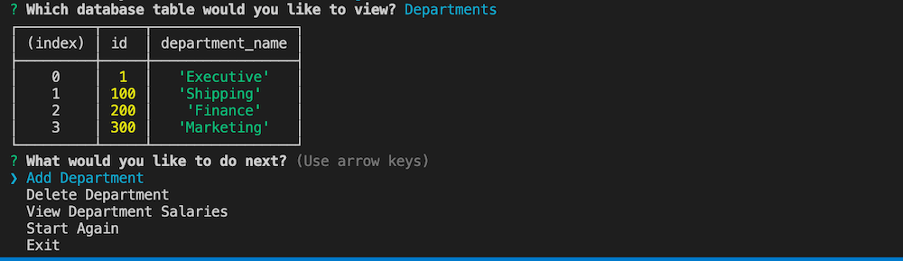
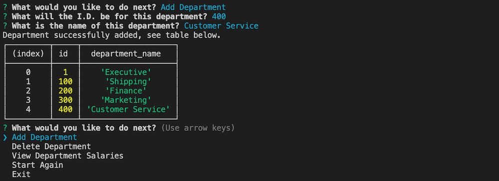
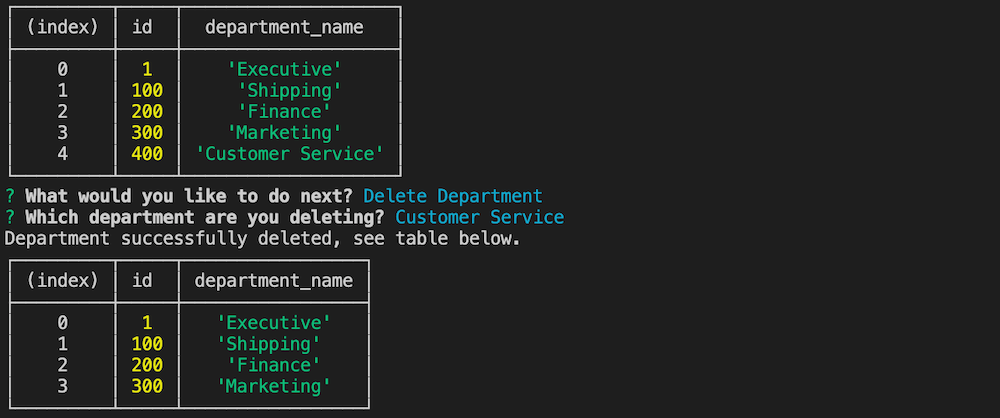
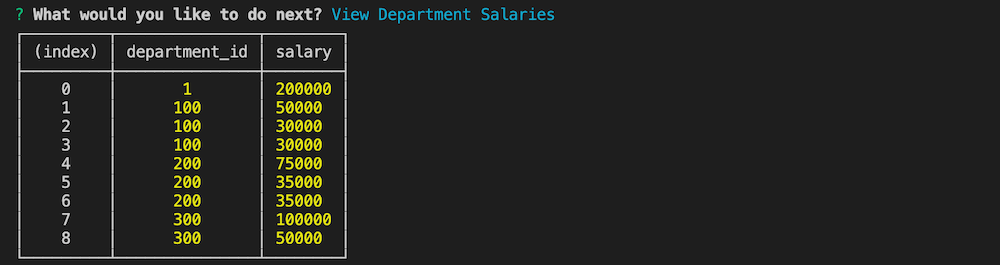
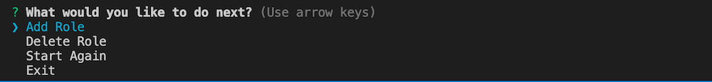
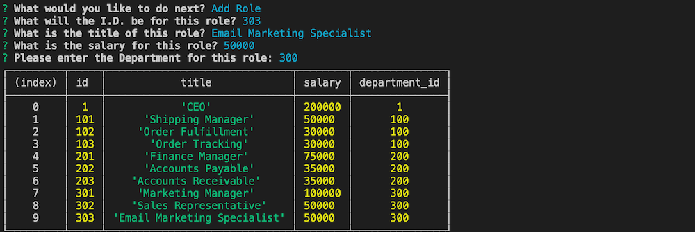
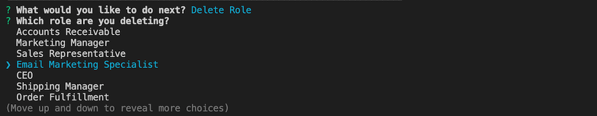

 

## Installation

Users must remember to run "npm install" after cloning this repo.

## Contributing

With thanks to instructor Jonathan Watson and his team of TAs (especially Peter and Phil!), and to Josh Furlin for 
his continued tutoring.

## License

MIT License

Copyright (c) 2020 Jeff Flynn

Permission is hereby granted, free of charge, to any person obtaining a copy
of this software and associated documentation files (the "Software"), to deal
in the Software without restriction, including without limitation the rights
to use, copy, modify, merge, publish, distribute, sublicense, and/or sell
copies of the Software, and to permit persons to whom the Software is
furnished to do so, subject to the following conditions:

The above copyright notice and this permission notice shall be included in all
copies or substantial portions of the Software.

THE SOFTWARE IS PROVIDED "AS IS", WITHOUT WARRANTY OF ANY KIND, EXPRESS OR
IMPLIED, INCLUDING BUT NOT LIMITED TO THE WARRANTIES OF MERCHANTABILITY,
FITNESS FOR A PARTICULAR PURPOSE AND NONINFRINGEMENT. IN NO EVENT SHALL THE
AUTHORS OR COPYRIGHT HOLDERS BE LIABLE FOR ANY CLAIM, DAMAGES OR OTHER
LIABILITY, WHETHER IN AN ACTION OF CONTRACT, TORT OR OTHERWISE, ARISING FROM,
OUT OF OR IN CONNECTION WITH THE SOFTWARE OR THE USE OR OTHER DEALINGS IN THE
SOFTWARE.

## Questions

Connect with me at Github: <a href="https://github.com/7J647">7J647</a> &nbsp;&nbsp;&nbsp;&nbsp;
Contact me via Email: [jeffreyedwardflynn@gmail.com](mailto:jeffreyedwardflynn@gmail.com)
 